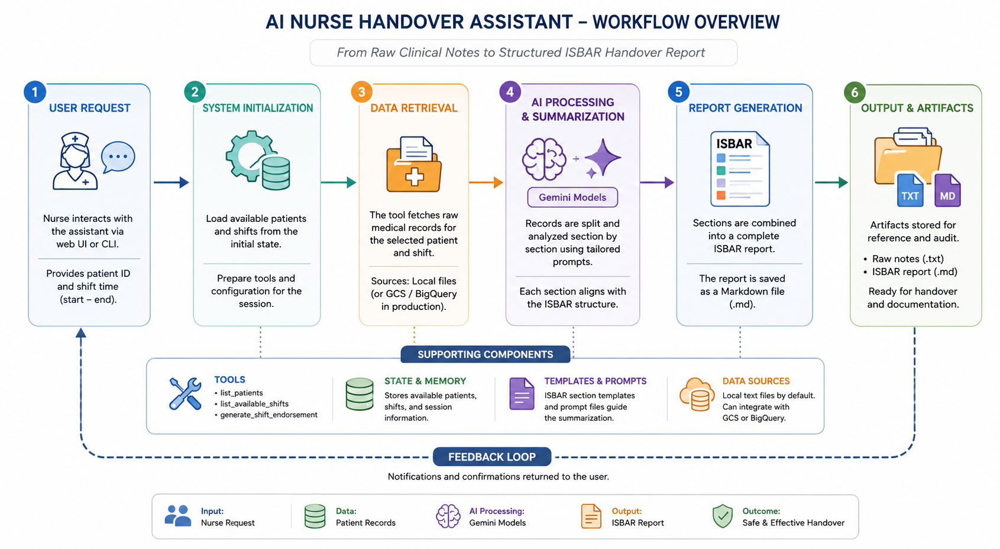

# AI-Based Nurse Shift Handover Assistant

## Introduction

The AI-Based Nurse Shift Handover Assistant is an intelligent application developed to simplify communication during nursing shift changes. It automatically analyzes detailed patient records and produces clear, well-organized handover reports following the internationally recognized ISBAR (Identification, Situation, Background, Assessment, Recommendation) framework. By automating report preparation, the system minimizes communication errors, reduces documentation time, and contributes to safer patient care.

## Main Capabilities

| Feature              | Description                                                                                                                                                                                                                                                                           |
| :------------------- | :------------------------------------------------------------------------------------------------------------------------------------------------------------------------------------------------------------------------------------------------------------------------------------ |
| **Interaction Style** | Conversational interface for natural communication with healthcare staff.                                                                                                                                                                                                                                                                                                                             |
| **Application Domain**         | Healthcare and clinical documentation.                                                                                                                                                                                                                                                                            |
| **Core Functions**     | **Available Tools**: `list_available_shifts`, `list_patients`, `generate_shift_endorsement`.<br>**Data Access**: Retrieves patient information from locally stored medical records..<br>**AI Processing**: Employs multiple Gemini model invocations to analyze clinical notes, organize relevant information, and generate structured ISBAR reports automatically. |

### Example Conversation

A typical interaction with the assistant may proceed as follows.

**User:** `Hi!`

**Assistant:** `Hello! I'm your AI nurse handover assistant. I can automatically prepare shift endorsement reports. I found a completed shift for patient MHID123456789 that began on 2026-07-05T07:30:00 and ended on 2026-07-05T19:30:00. Would you like me to generate the handover report?`

**User:** `Yes, please!`

**Assistant:** `The report has been successfully generated. The raw clinical notes have been saved as MHID123456789-1717763400-1717806600-raw-inputs.txt, and the completed ISBAR report has been stored as MHID123456789-1717763400-1717806600-endorsement.md.`

## System Workflow

The handover assistant follows a sequential processing pipeline.

1.  **Step 1 – System Initialization**: 
During startup, the application loads predefined information, including available patients and corresponding nursing shifts, through the `initialize_state` function located in `nurse_handover/agent.py`.

2.  **Step 2 – User Confirmation**: The assistant interacts with the nurse to identify the patient and confirm the specific shift that requires a handover summary.
3.  **Step 3 – Medical Record Collection**: 
After confirmation, the `generate_shift_endorsement` tool retrieves the patient's clinical records from text files stored in the `nurse_handover/data/` directory.
4.  **Step 4 – AI-Powered Summarization**:
The `Summarizer` class, implemented in `nurse_handover/summary.py`, coordinates several Gemini model requests. Instead of summarizing the document in a single prompt, it divides the task into separate ISBAR sections, applying specialized prompts such as `id_and_background_template.txt` and `situation_template.txt` to improve output quality.
 
5.  **Step 5 – Report Assembly**: Finally, the generated ISBAR sections are merged into a complete handover report and exported as a Markdown document.



## Installation and Execution

### Requirements

*   Python 3.11+
*   uv package manager
*   Either a Google Cloud project with Vertex AI enabled or a valid Gemini API key.

### Installation Procedure

1.  **Clone the repository.**
2.  **Install dependencies:**
    ```bash
    make install
    ```
3.  **Configure Environment Variables:**
    Create a `.env` file in the `/nurse-handover` directory  and update it with your own credentials.

    *   **For Vertex AI (Recommended):**
        ```env
        GOOGLE_CLOUD_PROJECT=your-gcp-project-id
        GOOGLE_CLOUD_LOCATION=your-gcp-region
        GOOGLE_GENAI_USE_VERTEXAI=true
        ```
    *   **For Gemini API Key:**
        ```env
        GOOGLE_API_KEY=your-api-key
        GOOGLE_GENAI_USE_VERTEXAI=false
        ```

### Running the Agent

You can interact with the agent using the ADK CLI or a web interface.

*   **Run with the ADK CLI:**
    ```bash
    make cli
    ```
*   **Run with the ADK Web UI:**
    ```bash
    make web
    ```
Executing this command starts a local web server, allowing interaction with the assistant directly through a web browser.

## Customization

This agent is designed to be a starting point. You can extend its functionality to fit your specific needs.

### Adding New Patient Data

Currently, the agent loads patient data from flat files. To add a new patient:

1.  **Create a Text File**: Add a new `.txt` file in the `python/agents/nurse-handover/nurse_handover/data/` directory. The filename must be the patient's ID (e.g., `MHID987654321.txt`).
2.  **Update Agent State**: Open `python/agents/nurse-handover/nurse_handover/agent.py` and add the new patient ID to the `patients` list within the `initialize_state` function.

    ```python
    def initialize_state(callback_context: CallbackContext) -> None:
        # ... (existing code)
        callback_context.state["patients"] = ["MHID123456789", "MHID987654321"] # Add new patient ID here
        # ... (existing code)
    ```


## Performance Evaluation

The repository includes automated tests that validate the functionality of the assistant.

```bash
make test
```
These tests verify that:

- Patients and shifts are correctly identified.
- Required output files are successfully generated.
- Reports conform to the ISBAR structure.
- The overall workflow executes as expected.
